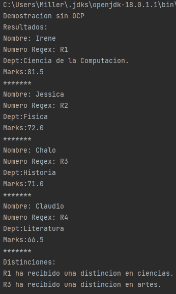
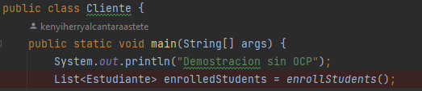
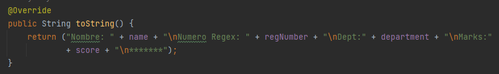
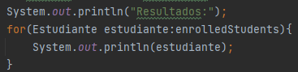
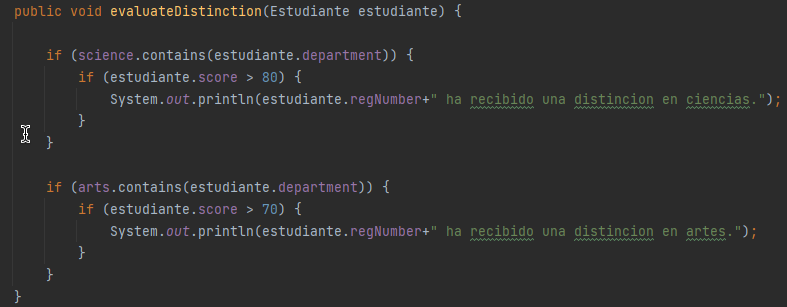
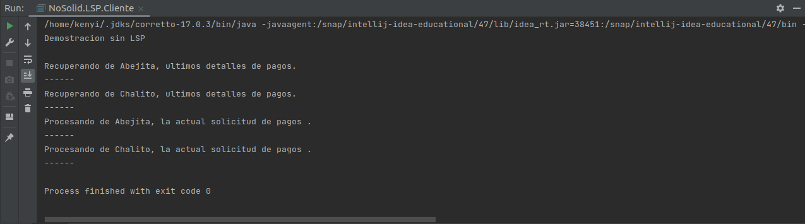
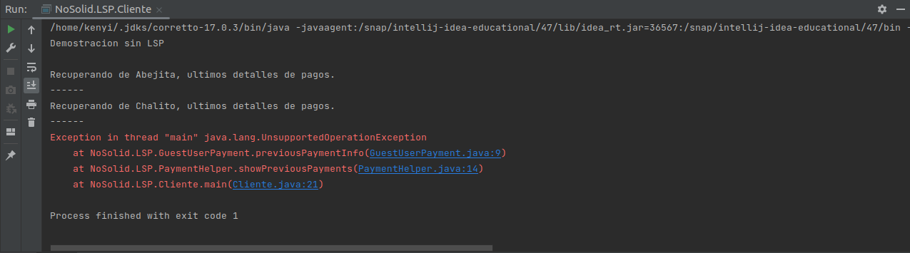
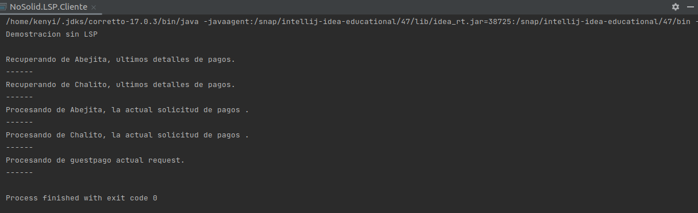
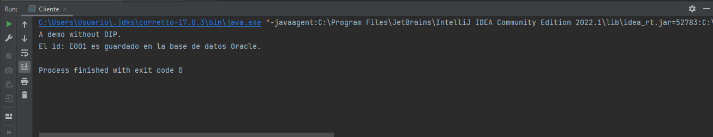

# PracticaCalificada3

| Integrantes                               |
|-------------------------------------------|
| Alcantara Astete Kenyi Herry  20180343C   |
| Caycho Villalobos José Gabriel 20190584C  |
| Alexander Miller Rojas Sanchez  20190574H |
|             Angel Darwing Chauca De La Cruz  20182666D                            |


### Principio de responsabilidad única (Angel)


* Preguntas 1- 4 → 3 puntos

1. Muestra la salida y explica los resultados en función de los métodos entregados

2. ¿Cuál es el problema con este diseño y las razones posibles del problema?


3. Modifica la clase Empleado.
    3.1 Agrega dos clases:
        3.1.1 La clase SeniorityChecker que contiene el método checkSeniority() 
        3.1.2 La clase GeneradorIDEmpleado contiene el método generateEmpId(...) para generar la identificación del empleado.
    3.2 Para mejorar la legibilidad del código y evitar torpezas dentro del método main():
        3.2.1 Utiliza elmétodo estático showEmpDetail(...). Este método llama al método displayEmpDetail() de
              Empleado, al método generateEmpId() de GeneradorIDEmpleado y al método checkSeniority()
              de SeniorityChecker. Tú entiendes que este método no era necesario, pero hace que el código
              del cliente sea simple y fácilmente comprensible.
              
4. Realiza una demostración completa que sigue a SRP. Explica tus resultados              


>### Principio abierto/cerrado  (Miller)

* Preguntas 5- 11 → 4 puntos
5. ¿Por que no es correcto colocar displayResult() y evaluateDistinction() en la misma
clase, como la siguiente:

```java
    class Estudiante {
        // ….
        public void displayResult() {
        // codigo
        }
        public void evaluateDistinction() {
        // codigo
        }
        // …
    }
```
>Al modificar ya sea displayRessult() agregrando una nueva salida de resultados o mas importante
>aun, al modificar evaluateDistinction() supongamos que queremos agregar nuevos departamentos por ejemplo ingenieria
>tendremos que modificar evaluateDistinction() para evaluar la distinción para el departamento de ingenieria pero este 
>metodo se encuentra dentro de estudiantes por ende estariamos modificando la clase estudiante lo que violaria el 
>principio de abierto y cerrado porque la clase Estudiante debe estar cerrada para cambios pero abierta a extenciones lo 
>adecuado seria aplicar el patron de diseño strategy creando una interfaz que me permita conectar Estudiante con las clases evaluateDistinction()
>y displayResult() de esta manera al modificar cualquiera de las 2 la class Estudiante permanece invariante cumpliento el
>principio SOLID de abierto y cerrado.

6.Muestra la salida y explica los resultados en función de los métodos entregados

>\

>Se crea una lista enrolledStudents del tipo Estudiante en la clase Cliente donde esta el main, se usa el método enrollStudents() para llenar dicha lista con los datos de los estudiantes, estos datos son suministrados por el cliente.\
>\
>Para poder mostrar los resultados usando un objeto de la clase Estudiante sobreescribimos el método toString() este metodo ya viene
> por defecto en java en el paquete java Object dicho método al imprimir un objeto de una clase te muestra el paquete, el nombre y un codigo hash de la Clase a cual pertenece el objeto impreso, convenientemente se sobrescribe el método para poder mostrar los atributos del estudiante sin hacerlo uno por uno.
>\
> Imprimimos\
>\
>Por ultimo de la misma manera que estudiantes se muestra las distinciones donde el método evaluateDistinction() es el encargado , mostrando distinciones de acuerdo al score que es una atributo de estudiante, te muestra si as\
>recibido una distinción de acuerdo al departamento que pertenezcan.\
>\
> Imprimimos\
> \

7. ¿Cuál es el problema con este diseño y las razones posibles del problema?

### Principio de sustitución de Liskov  (Kenyi)

* Preguntas 12- 18 → 4 puntos
12. Muestra la salida y explica los resultados en función de los métodos entregados

La salida luego de ejecutar el código es:



Se observa que primero se muestra los detalles de pago, realizadas
anteriormente, de todos los usuarios registrados (Abejita y Chalito).
Luego nos muestra las solicitudes actuales de pago de estos usuarios. 
>El ejecución en la clase "Cliente" sucede en el orden siguiente:
> 1. Abejita y Chalito como usuarios registrados quieren realizar un pago.
> Para realizar esta acción se instancian **pagoAbejita** y **pagoChalito**
> de la clase **RegisteredUserPayment**, quie esta implementada 
> de la interfas **Payment**, cuyos metodos son **previousPaymentInfo**
> y **newPayment**.
> 2. Luego se agregan **pagoAbejita** y **pagoChalito** a **helper**. Este ultimo es una instancia
>  de la clase **PaymentHelper**, quien se encarga de almacenar
> los pagos realizados de cada usuario. Tambein mostrar
>los pagos anteriores y las nuevas solictudes de pago de *todos* los usuarios.
>a travez de sus metodos **showPreviousPayments**  y **processNewPayments**.
> 3. Finalmente se ejecutan los metodos **showPreviousPayments**  y **processNewPayments** mostrandonos en la consola
> los resultados.
```java
public class Cliente {
    public static void main(String[] args) {
        System.out.println("Demostracion sin LSP\n");
        PaymentHelper helper = new PaymentHelper();

        // Abejita y Chalito deciden realizar un pago
        RegisteredUserPayment pagoAbejita = new RegisteredUserPayment("Abejita");
        RegisteredUserPayment pagoChalito = new RegisteredUserPayment("Chalito");

        //Almacenmos los pagos en helper
        helper.addUser(pagoAbejita);
        helper.addUser(pagoChalito);

        // Mostramos los detalles de los pagos previos y solicitudes actuales
        helper.showPreviousPayments();
        helper.processNewPayments();
        }
    }
```


13. Ahora supongamos que tienes un nuevo requisito que dice que necesitas admitir
    usuarios invitados en el futuro. Puedes procesar la solicitud de pago de un usuario invitado,
    pero no muestra su último detalle de pago. Entonces, crea la siguiente clase que implementa la
    interfaz de pago.

    >La clase **GuestUserPayment** que implementa **Payment** es:
 ```java
    class GuestUserPayment implements Payment {
        String name;
        public GuestUserPayment() {
            this.name = "guest";
        }
        @Override
        public void previousPaymentInfo(){
            //Se pasa una exepción no operación no soportada (inválida). 
            throw new UnsupportedOperationException();
        }
        @Override
        public void newPayment(){
            System.out.println("Procesando de "+name+ "pago actual request.");
        }
}
```
>En la sobreescritura del método **previousPaymentInfo** 
> pasamos una exepción de **UnsupportedOperationException**
> para aludir que esta operación no es válidad, ya que por lógica
> un usuario ***invitado*** no tiene registros de pagos anteriores, dado que no es un usuario registrado. 

14. Dentro del método main(), utilizas una instancia de usuario invitado e intenta 
    usar su clase auxiliar de la misma manera,¿ qué tipo de excepción te encuentras?¿Cuál es la
    solución?

El usuario invitado decide realizar un pago, para ello se
instancia **guestUser** de **GuestUserPayment** y agregamos a helper.
```java

public class Cliente {
    public static void main(String[] args) {
        System.out.println("Demostracion sin LSP\n");
        PaymentHelper helper = new PaymentHelper();

        RegisteredUserPayment pagoAbejita = new RegisteredUserPayment("Abejita");
        RegisteredUserPayment pagoChalito = new RegisteredUserPayment("Chalito");

        helper.addUser(pagoAbejita);
        helper.addUser(pagoChalito);

        //Un usuario invitado decide realizar un pago.
        GuestUserPayment guestUser = new GuestUserPayment();
        helper.addUser(guestUser);
        
        //Mostrando los detalles
        helper.showPreviousPayments();
        helper.processNewPayments();
    }
}

```
Cuando ejecutamos nos resulta:

> Nos resulta la exepcion **UnsupportedOperationException**.
> Esto debido a que estamos intentando ver los pagos anteriores
> de un usuario ***no*** regitrado (***invitado***). La lógica de por que se puso esta exepción
> en el código se explicó en la pregunta anterior. 

Para solucionar esto podemos hacer los siguiente en el método **showPreviousPayments** de la clase  **PaymentHelper**.
>Agregamos una condicional que verifica si un **pago** esta
> realizado por un usuario registrado para poder mostrar los detalles
> de los pagos anteriores.

```java

public class PaymentHelper {
    List<Payment> payments = new ArrayList<Payment>();

    public void addUser(Payment user){
        payments.add(user);
    }
    public void showPreviousPayments() {
        for (Payment payment: payments) {
            //Verificamos si esta registrado para mostrar los detalles de sus pagos anteriores.
            if (payment.getType().equals("registered")){
                payment.previousPaymentInfo();
                System.out.println("------");
            }
        }
    }
    public void processNewPayments()  {
        for (Payment payment: payments) {
            payment.newPayment();
            System.out.println("------");
        }
    }
}

```
> **Nota**:Para verificar el tipo de pago en la condicional,
> se utiliza el método **getType**. El cual tuvo que declarar
> en **Payment** y sobreescribir en cada una de las clases que la
> implementan.
> ``` java
> interface Payment {
>   void previousPaymentInfo();
>   void newPayment();
>   String getType(); //Nuevo método agregado
> }
> ```

El resultado de la ejecución sería los siguiente: 
>**Se observa que solo imprime los pagos previos de los
> usuarios registrados**. Luego imprime las solicitudes actuales
> tanto de los usuarios registrados como tambien del invitado.



15. Todo lo anterior, lo más importante es que viola el OCP cada vez que modifica una
    clase existente que usa esta cadena if-else. Entonces, busquemos una mejor solución.
>Efectivamente, si creamos otro tipo de **Payment** 
> tenemos que modificar la clase **PaymentHelper** especialmente en su 
> método **showPreviousPayments**.
> Agregando una nueva 
> condicional que maneje la nueva caracteristica de este nuevo tipo de pago. 
>El cual viola el principio de Abierto Cerrado (OCP).

16. Ajuste las interfaces PreviousPayment y NewPayment estos nuevos nombres en las clases.

El diseño solid siguieno LSP quedaría de la siguiente manera:

a. La interfase **PreviousPayment**:
>Se encarga de definir que toda clase que la implemente, pueda visualizar la información del pago registrado anteriormente.
``` java
interface PreviousPayment { 
  void previousPaymentInfo();
}
```


b. La interfase **NewPayment**:
>Se encarga de definir que toda clase que la implemente, pueda generar una solicitud de pago.
```java
interface NewPayment {
    void newPayment();
}
```

c. La clase **RegisteredUserPayment** implementa **NewPayment** y **PreviouPayment**:
>Un usuario registrado, cuando decide realizar un pago. Este debe ser capas de visualizar los pagos
> anteriores y generar nuevas solicitudes de pago.
```java
public class RegisteredUserPayment implements NewPayment,PreviousPayment {
    private String name;
    public RegisteredUserPayment(String userName) {
        this.name = userName;
    }
    @Override
    public void previousPaymentInfo(){
        System.out.println("Recuperando de "+ name+ ", ultimos detalles de pagos.");
    }

    @Override
    public void newPayment(){
        System.out.println("Procesando de "+name+", la actual solicitud de pagos .");
    }
}
```
d. La clase **GuestUserPayment** implementa solo **NewPayment**:
>Un usuario invitado cuando decide ralizar un pago. Este
> ***solo*** debe ser capaz de generar nuevas solicitudes de pago.
```java
public class GuestUserPayment implements NewPayment{
    public String name;
    public GuestUserPayment() {
        this.name = "guest";
    }
    @Override
    public void newPayment(){
        System.out.println("Procesando de "+name+ "pago actual request.");
    }
}
```
e. La clase **PaymentHelper**:
>Sus métodos **showPreviousPayments** y **processNewPayments** 
> se aplican sobre listas especificas de pagos. De tal manera que no hay la 
> necesidad de tener centencias if-then, cumpliendo con el OPC.
```java
public class PaymentHelper {
List<PreviousPayment> previousPayments = new ArrayList<PreviousPayment>();
List<NewPayment> newPayments = new ArrayList<NewPayment>();

    public void addPreviousPayment(PreviousPayment user){
        previousPayments.add(user);
    }
    public void addNewPayment(NewPayment user){
        newPayments.add(user);
    }
    public void showPreviousPayments() {
        for (PreviousPayment payment: previousPayments) {
                payment.previousPaymentInfo();
                System.out.println("------");
        }
    }
    public void processNewPayments()  {
        for (NewPayment payment: newPayments) {
            payment.newPayment();
            System.out.println("------");
        }
    }
}
```

f. La clase **Cliente**:
``` java
public class Cliente {
public static void main(String[] args) {

        System.out.println("Demostracion LSP.\n");
        PaymentHelper helper = new PaymentHelper();

        // Instanciando dos usuarios registrados
        RegisteredUserPayment irene = new RegisteredUserPayment("Irene");
        RegisteredUserPayment claudio = new RegisteredUserPayment("Claudio");
        // Instanciando el pago de un usuario invitado
        GuestUserPayment guestUser1 = new GuestUserPayment();

        // Consolidando la informacion del pago anterior al helper
        helper.addPreviousPayment(irene);
        helper.addPreviousPayment(claudio);

        // Consolidando nuevas solicitudes de pago al helper
        helper.addNewPayment(irene);
        helper.addNewPayment(claudio);
        helper.addNewPayment(guestUser1);

        // Recupera todos los pagos anteriores de los usuarios registrados
        helper.showPreviousPayments();

        // Procesa todas las solicitudes de pago nuevos de todos los usuarios
        helper.processNewPayments();
    }
}
```

17. ¿Cuáles son los cambios clave?
>1. Separar las responsabilidades de la interface **Payment**, en dos interfaces
>**PreviousPayment** y **NewPayment**, de tal manera que sea versatil en la implentacion de sus clases.

>2. La clase **GuestUserPayment** ahora **solo implementa
>una interface** que solo define la generacion de nuevos pagos. El cual es
>**NewPayment**.

>3. La clase **RegisteredUserPayment** ahora **implementa 
>dos interface** que tiene cada una su propia responsabilidad. **NewPayment**, que se encarga de definir la generacion de 
>nuevos pagos y **PreviousPayment** que se encarga de definir solo la visualizacion
>de los pagos previos. 

Los cambios anteriores hizo que los if-them de la clase **PaymentHelper** se eliminarán. 


18. Ten que aquí el enfoque clave estaba en el principio LSP, nada más. Podrías
refactorizar fácilmente el código del cliente usando algún método estático. Por ejemplo realiza
una modificación donde utilizas un método estático para mostrar todas las solicitudes de pago
y utilizar este método siempre que lo necesites.

>En esta refactorización. Se ha creado el método estático **mostrarSolicitudesDePago**, que como su nombre mismo lo dice "muestra las solicitudes de pago" en la clase **cliente**.
> Como se podrá observa en el siguiente código.

```java
public class Cliente {

    public static void main(String[] args) {

        System.out.println("Demostracion LSP.\n");
        PaymentHelper helper = new PaymentHelper();
        // Instanciando dos usuarios registrados
        RegisteredUserPayment irene = new RegisteredUserPayment("Irene");
        RegisteredUserPayment claudio = new RegisteredUserPayment("Claudio");
        // Instanciando el pago de un usuario invitado
        GuestUserPayment guestUser1 = new GuestUserPayment();

        // Consolidando la informacion del pago anterior al helper
        helper.addPreviousPayment(irene);
        helper.addPreviousPayment(claudio);

        // Consolidando nuevas solicitudes de pago al helper
        helper.addNewPayment(irene);
        helper.addNewPayment(claudio);
        helper.addNewPayment(guestUser1);

        // Recupera todos los pagos anteriores de los usuarios registrados
        helper.showPreviousPayments();

        // Utilizando el método estático
        mostrarSolicitudesDePago(helper);
    }

    static void mostrarSolicitudesDePago(PaymentHelper helper){
        helper.processNewPayments();
    }

}
```
### Principio de segregación de interfaz

19. ¿Por qué un usuario necesita cambiar una clase base (o una interfaz)?
>Si usuario tiene la necesidad de cambiar el comportamiento de una método 
> heredado (o implementado) de su clase base  (o una interfaz). Puede ser su tipo de retorno o
> tipo de parametros.
> Entonces se tiene que cambiar tambien en la clase base. Para que la sobreescritura sea coherente. 

20. Para usar esta jerarquía de herencia, una vez que modificas el método sendFax() a
    sendFax(Fax faxType) en la clase ImpresoraAvanzada, exige que cambies la interfaz de
    Impresora (sí, aquí también rompe el OCP).
    Cuando actualices Impresora, también debes actualizar la clase impresoraBasica para
    adaptarse a este cambio. ¡Ahora ves el problema!. Explica el problema.

Modificando el metodo **sendFax** de la clase **impresora
avanzada**:

Antes:
```java
    public class ImpresoraAvanzada implements Impresora {
    @Override
    public void printDocument() {
        System.out.println("La impresora avanzada imprime un documento.");
    }

    @Override
    public void sendFax() {
        System.out.println("La impresora avanzada envía un fax.");
    }
}
```
Despues:
```java
    public class ImpresoraAvanzada implements Impresora {
    @Override
    public void printDocument() {
        System.out.println("La impresora avanzada imprime un documento.");
    }

    //Modificación para que reciba un tipo de fax.
    @Override
    public void sendFax(Fax faxType) {
        System.out.println("La impresora avanzada envía un fax.");
    }
}
```
Esto nos da un error, ya que **sentFax** esta declarado el la 
interfaz **Impresora** como un método que no recibe ningún parámetro.
```java
interface Impresora {
    void printDocument();
    void sendFax(); //No recibe ningún parámetro.
}
```

Para solucionarlo tenemos que redeclarar este método. 
```java
interface Impresora {
    void printDocument();
    void sendFax(Fax faxType); //Redeclarando.
}
```

Pero esto afecta a la clase **ImpresoraBasica**, generando un error
de sobreescritura:
```java
class ImpresoraBasica implements Impresora {
    @Override
    public void printDocument() {
        System.out.println("La impresora basica imprime un documento.");
    }
    @Override
    public void sendFax() { //Error de sobreescritura
        throw new UnsupportedOperationException();
    }
}
```
Para solucionarlo tenemos que sobreescribir la nueva firma.

```java
class ImpresoraBasica implements Impresora {
    @Override
    public void printDocument() {
        System.out.println("La impresora basica imprime un documento.");
    }
    @Override
    public void sendFax(Fax faxType) { //Corrigiendo
        throw new UnsupportedOperationException();
    }
}
```
>Es bien sabido que el método **sentFax** de la clase **ImpresoraBasica** no es utilizada.
> Pero aun así tuvimos que realizar el cambio en su firma. Esto no es eficiente (Perdida de tiempo).
> y viola el principio abierto cerrado (OCP).

#### 21. Si has entendido correctamente el problema. El ISP te sugiere que te ocupes de 
este tipo de escenario. Explica tu respuesta.

>ISP nos sugiere que separemos la interfaz **Impresora** en dos interfaces; una para 
> imprimir y otra para enviar Fax. Ya que la clase
> **ImpresoraBasica** que la implementa, no tiene la necesidad de sobreescribir su metodo 
> **sentFax** ya que no es una de sus funciones que desempeña.

#### 22. ¿Es conveniente usar e inicializar el siguiente código?
```java
interface Impresora {
    void printDocument();
    void sendFax();
}
```
> No. Por lo visto anteriormente en la pregunta 21. La clase **ImpresoraBasica** 
> solo debe sobrescribir el método **printDocument**. Pero esta interfaz **Impresora**
> la obliga sobreescrir tambien el método **sentFax**, aunque no sea su naturaleza tener esta funcionalidad.

#### 23. Si comienzas tu codificación considerando las impresoras avanzadas que pueden
imprimir y enviar un fax, está bien. Pero en una etapa posterior, si tu programa también
necesita admitir impresoras básicas,¿ qué código puedes escribir?,

### Principio de inversión de dependencia (José)

* Preguntas 31- 36 → 4 puntos
31. Muestra la salida y explica los resultados en función de los métodos entregados
* La clase **Cliente** instancia un objeto *usuario* de la clase **InterfazUsuario**. 
* El objeto *usuario* llama a su método *saveEmployeeId* que recibe como argumento el ID del *usuario*.
* El método *saveEmployeeId* mediante el objeto *oracleDatabase* instanciado de la clase **OracleDatabase**
llama al método *saveEmpIdInDatabase* que muestra el siguiente mensaje en consola.



32. El programa es simple, pero ¿qué tipo de problemas presenta?
* Acoplamiento: La clase **InterfazUsuario** depende de la clase OracleDatabase, impidiendo reutilizar la clase 
**InterfazUsuario** con una Base de Datos diferente, reduciendo su flexibilidad.
* Dependencias no claras: El objeto *oracleDatabase* es más difícil de detectar en la clase **InterfazUsuario**, 
tenemos que leer de arriba hacia abajo para detectar su funcionalidad.
* Test más complicado: No se puede realizar tests a la clase **InterfazUsuario** de forma aislada, 
por ello, si el test falla, será difícil de detectar que objeto origina el error.

33-34. Completa todos los archivos siguientes de la sección SOLID
* InterfazUsuario.java
* BaseDatos.java 
* OracleDataBase.java 
* MySQLDatabase.java 
* Cliente.java

**InterfazUsuario**
```java
class InterfazUsuario {
    private final BaseDatos baseDatos;

    public InterfazUsuario(BaseDatos baseDatos) {
        this.baseDatos = baseDatos;
    }

    public void saveEmployeeId(String empId) {
        baseDatos.saveEmpIdInDatabase(empId);
    }
}
```

**BaseDatos**
```java
interface BaseDatos {
    void saveEmpIdInDatabase(String empId);
}
```

**OracleDatabase**
```java
class OracleDatabase implements BaseDatos {
    @Override
    public void saveEmpIdInDatabase(String empId) {
        System.out.println("El id: " + empId + " es guardado en la base de datos Oracle.");
    }
}
```

**MySQLDatabase**
```java
class MySQLDatabase implements BaseDatos {

    @Override
    public void saveEmpIdInDatabase(String empId) {
        System.out.println("El id: " + empId + " es guardado en la base de datos MySQL.");
    }
}
```

**Cliente**
```java
public class Cliente {
    public static void main(String[] args) {
        System.out.println("Demostracion con DIP");
        InterfazUsuario usuario;

        // Usando Oracle
        usuario = new InterfazUsuario(new OracleDatabase());
        usuario.saveEmployeeId("E001");

        // Usando Mysql
        usuario = new InterfazUsuario(new MySQLDatabase());
        usuario.saveEmployeeId("E001");

        // Cambiando la base de datos objetivo
        usuario = new InterfazUsuario(new OracleDatabase());
        usuario.saveEmployeeId("E001");
    }
}
```

Explica los resultados. ¿El programa resuelve todos los posibles problemas del programa que no usa DIP?.
El principio DIP resuelve los problemas anteriormente mencionados:

* Disminuye el Acoplamiento: La clase **InterfazUsuario** no depende de la clase OracleDatabase, pudiendo reutilizar la clase
  **InterfazUsuario** con una Base de Datos diferente, por ejemplo una Base de Datos MySQL, aumentando su flexibilidad.
* Quedan claro las dependencias: Podemos saber que Base de Datos utiliza la Interfaz Usuario debido a que la Base de Datos es 
enviada por nosotros. El objeto instanciado con una Base de Datos podemos saber, por lo tanto, es
  más difícil predecir que cambios realiza.
* Realizar los tests son menos complicados: Podemos realizar test de forma aislada, por ello, si un test falla, es más 
fácil ver que objeto es el culpable.

35. Encuentra alguna excepción a esta sugerencia.

>Los módulos de alto nivel simplemente no deberían depender de los módulos de bajo nivel de ninguna manera.


38. El constructor de la clase InterfazUsuario acepta un parámetro de base de datos.
Proporciona una instalación adicional a un usuario cuando utiliza tanto el constructor como el
método setter (setDatabase) dentro de esta clase. ¿Cuál es el beneficio?.