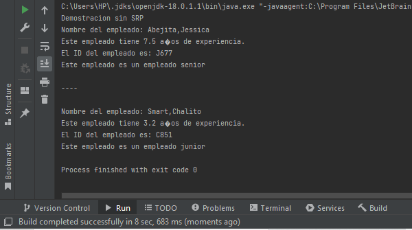
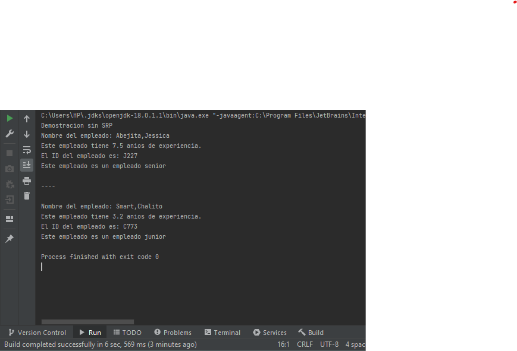
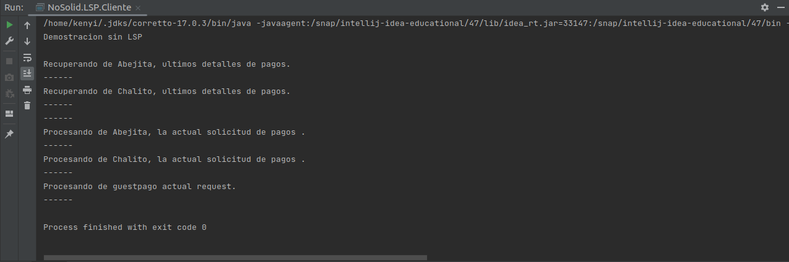

# PracticaCalificada3

| Integrantes                               |
|-------------------------------------------|
| Alcantara Astete Kenyi Herry  20180343C   |
| Caycho Villalobos José Gabriel 20190584C  |
| Alexander Miller Rojas Sanchez  20190574H |
|             Angel Darwing Chauca De La Cruz  20182666D                            |


### Principio de responsabilidad única (Angel)


* Preguntas 1- 4 → 3 puntos

1. Muestra la salida y explica los resultados en función de los métodos entregados

> \
* El metodo ( public void displayEmpDetail()) muestra en pantalla el nombre y anios de experiencia.
* El metodo (public String checkSeniority(double experienceInYears)) Verifica si los anios de xperiaencia es mayor a 5.
* El metodo (generateEmpID(String empFirstName)) genera aleatoriamente el ID del empleado.
  Esto en base al primer nombre del empleado.
* El metodo (showEmpDetail(Empleado emp)) muestra en pantalla los detalles obtenidos del empleado.

2. ¿Cuál es el problema con este diseño y las razones posibles del problema?
> El problema con el diseño en el que se encuentra el codigo es que incumple el primer principio
 SOLID, el cual es el SRP. Debido a que las clases tienen diferentes propositos o roles, por ejemplo
la clase Cliente tiene 2 métodos: main() y showEmpDetail(), que tienen diferentes propósitos.
3. Modifica la clase Empleado. 
> 3.1 Agrega dos clases:
* 3.1.1 La clase SeniorityChecker que contiene el método checkSeniority() 
```java

public class SeniorityChecker {
    public String checkSeniority(double experienceInYears){

        return  experienceInYears > 5 ?"senior":"junior";
    }
}

```
* 3.1.2 La clase GeneradorIDEmpleado contiene el método generateEmpId(...) para generar la identificación del empleado.
```java
import java.util.Random;

public class GeneradorIDEmpleado {
    String empId;
    public String generateEmpId(String empFirstName){
        int random = new Random().nextInt(1000);
        empId = empFirstName.substring(0,1)+random;
        return empId;
    }

}

```
> 3.2 Para mejorar la legibilidad del código y evitar torpezas dentro del método main():
* 3.2.1 Utiliza elmétodo estático showEmpDetail(...). Este método llama al método displayEmpDetail() de
              Empleado, al método generateEmpId() de GeneradorIDEmpleado y al método checkSeniority()
              de SeniorityChecker. Tú entiendes que este método no era necesario, pero hace que el código
              del cliente sea simple y fácilmente comprensible.
```java
    private static void showEmpDetail(Empleado emp) {
        GeneradorIDEmpleado id = new GeneradorIDEmpleado();
        SeniorityChecker se= new SeniorityChecker();
        emp.displayEmpDetail();
        System.out.println("El ID del empleado es: "+ id.generateEmpId(emp.firstName));
        System.out.println("Este empleado es un" + " empleado " + se.checkSeniority(emp.experienceInYears));
        }
```            
4. Realiza una demostración completa que sigue a SRP. Explica tus resultados              

> 
Se puede observar que el resultado conSRP es el mismo sin SRP, pero a diferencia del codigo sin SRP se tien un codigo
limpio y mejor estructurado, adicionalmente se tiene un menor tiempo en el Build.
### Principio abierto/cerrado  (Miller)


>### Principio abierto/cerrado  (Miller)

* Preguntas 5- 11 → 4 puntos
5. ¿Por que no es correcto colocar displayResult() y evaluateDistinction() en la misma
clase, como la siguiente:

```java
    class Estudiante {
        // ….
        public void displayResult() {
        // codigo
        }
        public void evaluateDistinction() {
        // codigo
        }
        // …
    }
```
>Al modificar ya sea displayRessult() agregrando una nueva salida de resultados o mas importante
>aun, al modificar evaluateDistinction() supongamos que queremos agregar nuevos departamentos por ejemplo ingenieria
>tendremos que modificar evaluateDistinction() para evaluar la distinción para el departamento de ingenieria pero este 
>metodo se encuentra dentro de estudiantes por ende estariamos modificando la clase estudiante lo que violaria el 
>principio de abierto y cerrado porque la clase Estudiante debe estar cerrada para cambios pero abierta a extenciones lo 
>adecuado seria aplicar el patron de diseño strategy creando una interfaz que me permita conectar Estudiante con las clases evaluateDistinction()
>y displayResult() de esta manera al modificar cualquiera de las 2 la class Estudiante permanece invariante cumpliento el
>principio SOLID de abierto y cerrado.

6.Muestra la salida y explica los resultados en función de los métodos entregados

>\

>Se crea una lista enrolledStudents del tipo Estudiante en la clase Cliente donde esta el main, se usa el método enrollStudents() para llenar dicha lista con los datos de los estudiantes, estos datos son suministrados por el cliente.\
>\
>Para poder mostrar los resultados usando un objeto de la clase Estudiante sobreescribimos el método toString() este metodo ya viene
> por defecto en java en el paquete java Object dicho método al imprimir un objeto de una clase te muestra el paquete, el nombre y un codigo hash de la Clase a cual pertenece el objeto impreso, convenientemente se sobrescribe el método para poder mostrar los atributos del estudiante sin hacerlo uno por uno.
>\
> Imprimimos\
>\
>Por ultimo de la misma manera que estudiantes se muestra las distinciones donde el método evaluateDistinction() es el encargado , mostrando distinciones de acuerdo al score que es una atributo de estudiante, te muestra si as\
>recibido una distinción de acuerdo al departamento que pertenezcan.\
>\
> Imprimimos\
> \

7. ¿Cuál es el problema con este diseño y las razones posibles del problema?

### Principio de sustitución de Liskov  (Kenyi)

* Preguntas 12- 18 → 4 puntos
12. Muestra la salida y explica los resultados en función de los métodos entregados


>Se que observa que primero se muestra las solicitudes anterioes
>luego ..


13. Agregando
14. Dentro del método main(), utilizas una instancia de usuario invitado e intentas
    usar su clase auxiliar de la misma manera,¿ qué tipo de excepción te encuentras?¿Cuál es la
    solución?

Nos resulta:

> Nos resulta la exepcion java.lang.UnsupportedOperationException, es decir la operación
> que se quiere ejecutar no es compatible.

>Para olucionar debemmos, resultandonos:



### Principio de segregación de interfaz

* Preguntas 19- 30 → 5 puntos

### Principio de inversión de dependencia (José)

* Preguntas 31- 36 → 4 puntos
31. Muestra la salida y explica los resultados en función de los métodos entregados
* La clase **Cliente** instancia un objeto *usuario* de la clase **InterfazUsuario**. 
* El objeto *usuario* llama a su método *saveEmployeeId* que recibe como argumento el ID del *usuario*.
* El método *saveEmployeeId* mediante el objeto *oracleDatabase* instanciado de la clase **OracleDatabase**
llama al método *saveEmpIdInDatabase* que muestra el siguiente mensaje en consola.


32. El programa es simple, pero ¿qué tipo de problemas presenta?
* Acoplamiento: La clase **InterfazUsuario** depende de la clase OracleDatabase, impidiendo reutilizar la clase 
**InterfazUsuario** con una Base de Datos diferente, reduciendo su flexibilidad.
* Dependencias no claras: El objeto *oracleDatabase* es más difícil de detectar en la clase **InterfazUsuario**, 
tenemos que leer de arriba hacia abajo para detectar su funcionalidad.
* Test más complicado: No se puede realizar tests a la clase **InterfazUsuario** de forma aislada, 
por ello, si el test falla, será difícil de detectar que objeto origina el error.

33-34. Completa todos los archivos siguientes de la sección SOLID
* InterfazUsuario.java
* BaseDatos.java 
* OracleDataBase.java 
* MySQLDatabase.java 
* Cliente.java

**InterfazUsuario**
```java
class InterfazUsuario {
    private final BaseDatos baseDatos;

    public InterfazUsuario(BaseDatos baseDatos) {
        this.baseDatos = baseDatos;
    }

    public void saveEmployeeId(String empId) {
        baseDatos.saveEmpIdInDatabase(empId);
    }
}
```

**BaseDatos**
```java
interface BaseDatos {
    void saveEmpIdInDatabase(String empId);
}
```

**OracleDatabase**
```java
class OracleDatabase implements BaseDatos {
    @Override
    public void saveEmpIdInDatabase(String empId) {
        System.out.println("El id: " + empId + " es guardado en la base de datos Oracle.");
    }
}
```

**MySQLDatabase**
```java
class MySQLDatabase implements BaseDatos {

    @Override
    public void saveEmpIdInDatabase(String empId) {
        System.out.println("El id: " + empId + " es guardado en la base de datos MySQL.");
    }
}
```

**Cliente**
```java
public class Cliente {
    public static void main(String[] args) {
        System.out.println("Demostracion con DIP");
        InterfazUsuario usuario;

        // Usando Oracle
        usuario = new InterfazUsuario(new OracleDatabase());
        usuario.saveEmployeeId("E001");

        // Usando Mysql
        usuario = new InterfazUsuario(new MySQLDatabase());
        usuario.saveEmployeeId("E001");

        // Cambiando la base de datos objetivo
        usuario = new InterfazUsuario(new OracleDatabase());
        usuario.saveEmployeeId("E001");
    }
}
```

Explica los resultados. ¿El programa resuelve todos los posibles problemas del programa que no usa DIP?.
El principio DIP resuelve los problemas anteriormente mencionados:

* Disminuye el Acoplamiento: La clase **InterfazUsuario** no depende de la clase OracleDatabase, pudiendo reutilizar la clase
  **InterfazUsuario** con una Base de Datos diferente, por ejemplo una Base de Datos MySQL, aumentando su flexibilidad.
* Quedan claro las dependencias: Podemos saber que Base de Datos utiliza la Interfaz Usuario debido a que la Base de Datos es 
enviada por nosotros. El objeto instanciado con una Base de Datos podemos saber, por lo tanto, es
  más difícil predecir que cambios realiza.
* Realizar los tests son menos complicados: Podemos realizar test de forma aislada, por ello, si un test falla, es más 
fácil ver que objeto es el culpable.

35. Encuentra alguna excepción a esta sugerencia.

>Los módulos de alto nivel simplemente no deberían depender de los módulos de bajo nivel de ninguna manera.


38. El constructor de la clase InterfazUsuario acepta un parámetro de base de datos.
Proporciona una instalación adicional a un usuario cuando utiliza tanto el constructor como el
método setter (setDatabase) dentro de esta clase. ¿Cuál es el beneficio?.
